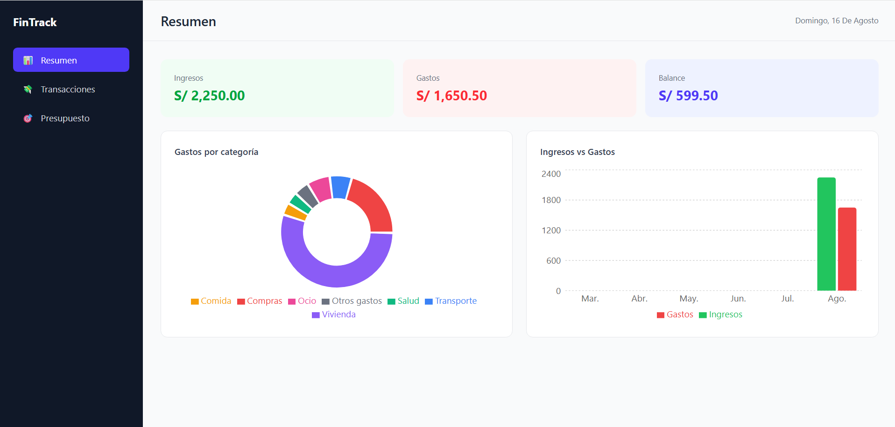

# 💰 FinTrack

Dashboard de finanzas personales construido con React y TypeScript. Permite registrar ingresos y gastos, visualizar tendencias con gráficos, y controlar un presupuesto mensual por categoría — todo persistido localmente en el navegador.

🔗 **[Ver demo en vivo](https://fintrack-pm.vercel.app)**



## 📌 Sobre el proyecto

FinTrack simula una aplicación real de control de gastos personales, sin necesidad de backend: toda la información se guarda en `localStorage`, por lo que persiste entre sesiones sin requerir cuenta ni servidor.

Este proyecto forma parte de mi portafolio como Full Stack Developer, un conjunto de proyectos donde cada uno demuestra una habilidad distinta — desde maquetación semántica y JavaScript vanilla, hasta aplicaciones interactivas con React como esta.

> [!NOTE]
> Los datos se guardan únicamente en tu navegador (`localStorage`). Si limpias el caché o cambias de navegador, la información no se transfiere.

## ✨ Funcionalidades

- **Registro de transacciones** (ingresos y gastos) con categoría, descripción y fecha
- **Dashboard de resumen** con ingresos, gastos y balance del mes actual
- **Gráficos interactivos**: distribución de gastos por categoría y tendencia de ingresos vs gastos de los últimos 6 meses
- **Presupuesto mensual** por categoría, con barras de progreso que alertan al superar el límite
- **Filtros** por tipo de transacción y categoría
- **Paginación** del historial de transacciones
- **Diseño responsive**: sidebar en desktop/tablet, barra de navegación inferior en mobile
- **Persistencia local** vía `localStorage`, sin necesidad de backend

## 🛠️ Tecnologías

- React + TypeScript
- Vite
- Tailwind CSS v4
- Recharts (gráficos)
- pnpm

## 📂 Estructura del proyecto

```
fintrack/
├── src/
│   ├── components/
│   │   └── layout/         # Sidebar, Header
│   ├── features/
│   │   ├── transactions/   # formulario, lista, filtros, paginación
│   │   ├── budget/          # presupuesto y barras de progreso
│   │   └── dashboard/       # cards de resumen y gráficos
│   ├── hooks/
│   │   └── useLocalStorage.ts
│   ├── data/
│   │   └── categories.ts
│   ├── types/
│   │   └── index.ts
│   ├── utils/
│   │   └── formatters.ts
│   ├── App.tsx
│   └── main.tsx
│
├── vite.config.ts
├── package.json
└── README.md
```

## 🚀 Cómo correrlo localmente

```bash
git clone https://github.com/tu-usuario/fintrack.git
cd fintrack
pnpm install
pnpm run dev
```

## 🎨 Decisiones de diseño

- **Categorías fijas en código** (no editables por el usuario en este MVP) para evitar datos huérfanos si se elimina una categoría con transacciones asociadas.
- **`items-start` en el grid** del formulario y la lista de transacciones, para que el formulario no se estire junto con una lista larga — cada elemento mantiene su altura natural.
- **Fecha calculada en hora local**, no con `toISOString()` (que devuelve UTC), para evitar que el formulario precargue la fecha del día siguiente cerca de la medianoche.
- **Paginación en vez de scroll infinito**, ya que en un dashboard financiero el usuario se beneficia de tener referencia clara de en qué "página" de su historial está.

> [!TIP]
> Si vas a probar la app desde cero, agrega algunas transacciones con fechas de meses anteriores para ver el gráfico de tendencia (Ingresos vs Gastos) con más de un mes de datos.

> [!IMPORTANT]
> El componente `Cell` de Recharts está marcado como deprecado (se removerá en su v4.0), pero se mantiene intencionalmente en este proyecto porque el reemplazo oficial (`shape`/`content`) aún no tiene una migración estable sin pérdida de funcionalidad (colores del legend). Se revisará al actualizar la dependencia a una versión mayor.

## 📄 Licencia

Este proyecto está bajo la licencia MIT — ver el archivo [LICENSE](LICENSE) para más detalles.

## 👤 Autor

**Paul Muñoz**

Full Stack Developer — Java · Spring Boot · React · TypeScript

> [!NOTE]
> Cualquier feedback o sugerencia es bienvenido.

⭐ Si este proyecto te resulta interesante, ¡no dudes en darle una estrella al repositorio!